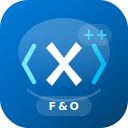
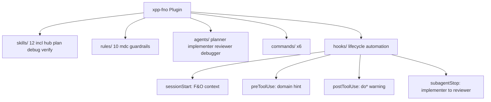

<p align="center">
  
</p>

# D365 F&O X++ Cursor Plugin

Microsoft-aligned **skills**, **rules**, **agents**, **commands**, and **hooks** for Dynamics 365 Finance and Operations X++ development in Cursor.

**Platform scope:** D365 Finance and Operations only — not AX 2012 or Business Central.

**Version:** 1.1.0 — see [CHANGELOG](CHANGELOG.md) and [AGENTS.md](AGENTS.md) for the full component inventory.

## What's included

| Component | Count | Purpose |
|-----------|-------|---------|
| Skills | 12 (59+ atomic rules) | Deep Microsoft-aligned reference with BAD/GOOD examples |
| Rules | 10 `.mdc` files | Concise file-triggered guardrails for Ax* artifacts |
| Agents | 4 subagents | Plan, implement, review, debug workflows |
| Commands | 6 slash commands | Discoverable entry points for skills and agents |
| Hooks | 4 lifecycle events | Session context, pre/post-write hints, implementer→reviewer chain |

## Architecture



## Installation

### Marketplace (after publish)

In Cursor Agent chat:

```text
/add-plugin xpp-fno
```

### Local development

1. Clone this repository.
2. Install the plugin from the local path using Cursor's plugin install flow (or point `--plugin-dir` at the repo root if supported in your Cursor version).
3. Restart Cursor or start a new agent session.

### Prerequisites

- Cursor with Agent mode enabled
- A D365 F&O X++ project with `AxClass/`, `AxTable/`, or similar folders
- **PowerShell** on Windows for hooks (local IDE only)
- Recommended: [Microsoft Learn MCP](https://learn.microsoft.com/) configured as `user-microsoft-learn` for official F&O documentation

## Quick start

1. Open a D365 F&O extension repository in Cursor.
2. Plan: `/xpp-fno-plan` (in-chat) or `/xpp-fno-planner` (subagent with repo exploration).
3. Implement: `/xpp-fno-implement` or `/xpp-fno-implementer` with the plan.
4. Review: the `subagentStop` hook auto-chains `/xpp-fno-reviewer` when Ax* files were modified.
5. Optional: `/xpp-fno-verify` for compile/BP/test evidence; `/xpp-fno-debug` if something fails.

Verify install: `powershell -File scripts/verify-plugin.ps1`

## Invoke reference

| Command | Type | Purpose |
|---------|------|---------|
| `/xpp-fno-planner` | Agent (readonly) | Pre-implementation plan (subagent) |
| `/xpp-fno-plan` | Skill / command | In-chat planning |
| `/xpp-fno-implementer` | Agent | Build extensions |
| `/xpp-fno-implement` | Command | Alias to implementer workflow |
| `/xpp-fno-reviewer` | Agent (readonly) | 12-step pre-merge audit |
| `/xpp-fno-review` | Command | Alias to reviewer workflow |
| `/xpp-fno-debugger` | Agent (readonly) | Systematic F&O debugging |
| `/xpp-fno-debug` | Skill / command | Debug workflow |
| `/xpp-fno-verify` | Skill / command | Evidence-based verification |
| `/xpp-fno-code-review` | Skill / command | PR review workflow (manual invoke) |

Domain skills (`xpp-fno-data`, `xpp-fno-extensibility`, etc.) load automatically when relevant or when mentioned in chat.

## Documentation

| Guide | Description |
|-------|-------------|
| [How it works](docs/how-it-works.md) | Architecture — skills, rules, agents, commands, hooks |
| [Getting started](docs/getting-started.md) | Install, prerequisites, first session, migration |
| [Commands](docs/commands.md) | All 6 slash commands and when to use each |
| [Skills](docs/skills.md) | Full skill catalog, hub router, extension decision tree |
| [Rules](docs/rules.md) | Rule triggers, globs, scenario mapping |
| [Agents](docs/agents.md) | Planner → implementer → reviewer → debugger |
| [Hooks](docs/hooks.md) | Lifecycle automation, limitations, debugging |
| [Debugging](docs/debugging.md) | F&O runtime debug workflow |
| [Testing](docs/testing.md) | Verification vs SysTest authoring |
| [Workflows](docs/workflows.md) | Eight end-to-end worked examples |
| [Troubleshooting](docs/troubleshooting.md) | Common problems and fixes |
| [Contributing](docs/contributing.md) | Sync script, versioning, release checklist |

## Migration from user-level assets

If you previously installed skills, rules, agents, or hooks under `~/.cursor/`, remove or disable those duplicates after installing this plugin to avoid double-loading:

- `~/.cursor/skills/xpp-fno-*`
- `~/.cursor/rules/xpp-fno-*.mdc`
- `~/.cursor/agents/xpp-fno-*.md`
- xpp-fno entries in `~/.cursor/hooks.json`

See [Getting started — Coexistence / migration](docs/getting-started.md#coexistence--migration) for details.

## Project template

Use [d365-fno-cursor-template](https://github.com/jaderbuenodeoliveira/d365-fno-cursor-template) as a starter F&O repo with optional project-level agent overrides.

## Brand assets

Marketplace and branding files live in [`assets/`](assets/). See [`assets/README.md`](assets/README.md) for variants (padded icon, banner, PNG exports).

Regenerate PNGs: `powershell -File scripts/export-logo-pngs.ps1`

## License

MIT — see [LICENSE](LICENSE).
