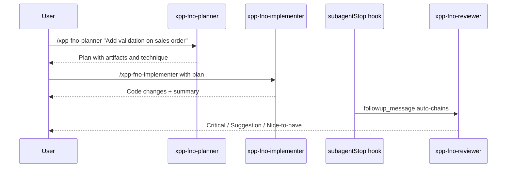

# Agents

The xpp-fno plugin ships **4 specialized subagents** for D365 F&O X++ workflows.

## Concepts

- Agents are invoked via `/agent-name` in Cursor Agent chat.
- **Planner**, **Reviewer**, and **Debugger** are readonly — they analyze and report but do not edit files.
- **Implementer** can read and write files following skills and rules.
- Use built-in **explore** and **bash** subagents for repo discovery and git operations — the xpp-fno agents delegate to them rather than duplicating capability.

## Commands vs agents

Some workflows have both a **command** (slash menu entry) and an **agent** (subagent). Commands improve discoverability; agents run in isolated context with explore/bash.

| Workflow | Command (in-chat or delegates) | Agent (subagent) | Prefer agent when |
|----------|-------------------------------|------------------|-------------------|
| Plan | `/xpp-fno-plan` | `/xpp-fno-planner` | Repo exploration needed |
| Implement | `/xpp-fno-implement` | `/xpp-fno-implementer` | Multi-file isolated build |
| Review | `/xpp-fno-review` | `/xpp-fno-reviewer` | Full git diff audit |
| Debug | `/xpp-fno-debug` | `/xpp-fno-debugger` | Complex trace across repo |
| Code review | `/xpp-fno-code-review` | — | In-chat checklist only |
| Verify | `/xpp-fno-verify` | — | Evidence check in current chat |

See [Commands](commands.md) for the full command reference.

## Agent reference

| Agent | Command | Mode | Purpose |
|-------|---------|------|---------|
| `xpp-fno-planner` | `/xpp-fno-planner` | readonly | Pre-implementation plan: artifacts, technique, risks, quality gates |
| `xpp-fno-implementer` | `/xpp-fno-implementer` | read/write | Build extensions per skills + rules |
| `xpp-fno-reviewer` | `/xpp-fno-reviewer` | readonly | 12-step pre-merge checklist against actual diff |
| `xpp-fno-debugger` | `/xpp-fno-debugger` | readonly | Systematic F&O debugging (loads xpp-fno-debug skill) |

## Recommended workflow



The `subagentStop` hook automatically chains to `/xpp-fno-reviewer` when the implementer completes and modified Ax* files — unless `loop_limit` was reached or no F&O artifacts changed.

## xpp-fno-planner

**When to use:** Multi-artifact work before writing code — table extensions, CoC, forms, batch jobs, security, tests.

**What it does:**

1. Clarifies requirement and affected standard artifacts.
2. Reads hub skill extension decision tree (`../skills/xpp-fno-development/SKILL.md`).
3. Applies scenario router (`../rules/xpp-fno-scenario-router.mdc`).
4. Delegates repo discovery to built-in **explore** (searches `AxClass/`, `AxTable/`, etc.).
5. Uses **microsoft-learn** MCP when Microsoft guidance is unclear.

**Output format:**

```markdown
## Requirement summary
## Recommended artifacts
| Artifact | Type | Technique | Notes |
## Quality gates
## Risks (breaking changes, missing extension points, security)
## Next step
Invoke `/xpp-fno-implementer` with this plan.
```

**Does not edit files.**

## xpp-fno-implementer

**When to use:** Ready to implement from a planner output or a clear single-artifact task.

**What it does:**

1. Enforces core non-negotiables from `xpp-fno-core.mdc`.
2. Follows planner output if provided; otherwise self-plans via scenario router.
3. Loads domain skill + rule per artifact type:

| Work | Skill | Rule |
|------|-------|------|
| CoC, ExtensionOf, events | `xpp-fno-extensibility` | `xpp-fno-extensibility.mdc` |
| SOLID, method design | `xpp-fno-extensible-design` | `xpp-fno-extensible-design.mdc` |
| Tables, CRUD, TTS, entities | `xpp-fno-data` | `xpp-fno-data-access.mdc` |
| Batch, SysOperation | `xpp-fno-business-logic` | `xpp-fno-batch-logic.mdc` |
| Forms, patterns | `xpp-fno-forms-ui` | `xpp-fno-forms-ui.mdc` |
| Roles, duties, entry points | `xpp-fno-security` | `xpp-fno-security.mdc` |
| SysTest, ATL | `xpp-fno-testing` | `xpp-fno-testing.mdc` |

4. Uses built-in **explore** to match repo naming and model layout before creating artifacts.
5. Summarizes changes and suggests `/xpp-fno-reviewer` before merge.

## xpp-fno-reviewer

**When to use:** After implementer completes, or before merging a PR.

**What it does:**

1. Loads review skill (`../skills/xpp-fno-code-review/SKILL.md`).
2. Uses built-in **bash** for `git diff`, `git status`, branch context.
3. Uses built-in **explore** to inspect changed Ax* artifacts.
4. Cross-checks against atomic skill rules and Cursor rules.
5. Runs 12-step checklist against the **actual diff** — does not accept claims without evidence.

**Output categories:**

- **Critical** — Must fix before merge (overlayering, missing forUpdate, unsecured entry points, `doUpdate`)
- **Suggestion** — Should improve (method length, missing tests, suboptimal pattern)
- **Nice to have** — Optional enhancement

References specific atomic rules by ID (e.g. `data-forupdate-before-mutate`, `ext-coc-next-first-level`).

**Does not edit files.**

## xpp-fno-debugger

**When to use:** Runtime failures — Infolog errors, batch job failures, CoC not firing, unexpected behavior in F&O.

**What it does:**

1. Loads debug skill (`../skills/xpp-fno-debug/SKILL.md`) and debugging rule (`../rules/xpp-fno-debugging.mdc`).
2. Follows systematic workflow: reproduce → isolate → hypothesize → verify fix.
3. Delegates repo discovery to built-in **explore** (searches call sites, CoC chains, batch classes).
4. Uses **bash** for git history, log snippets, or build output when available.

**Output format:**

```markdown
## Symptom
## Reproduction steps
## Root cause (with evidence)
## Recommended fix (minimal change)
## Verification steps — invoke `/xpp-fno-verify` when ready
```

**Does not edit files.** For fixes, follow up with `/xpp-fno-implementer`.

## Skill vs agent: code review

| | `/xpp-fno-code-review` | `/xpp-fno-reviewer` |
|---|------------------------|---------------------|
| Type | Skill | Agent (subagent) |
| Invocation | Manual only (`disable-model-invocation: true`) | `/xpp-fno-reviewer` |
| Context | Single-turn in parent agent | Isolated with explore/bash |
| Best for | Quick review in current chat | Deep diff-based audit before merge |

Use the **reviewer agent** for pre-merge validation. Use the **code-review skill** when you want a structured checklist in the current conversation.

## Skill vs agent: plan and debug

| | `/xpp-fno-plan` | `/xpp-fno-planner` |
|---|-----------------|---------------------|
| Type | Skill | Agent (subagent) |
| Context | Current chat | Isolated with explore |
| Best for | Quick structured plan | Plan requiring repo search |

| | `/xpp-fno-debug` | `/xpp-fno-debugger` |
|---|------------------|---------------------|
| Type | Skill | Agent (subagent) |
| Context | Current chat | Isolated with explore/bash |
| Best for | Known failure with clear context | Complex multi-file investigation |

## Project overrides

The [d365-fno-cursor-template](https://github.com/jboliveira/d365-fno-cursor-template) can ship project-level agents at `.cursor/agents/` to override plugin defaults for repo-specific conventions (publisher prefix, model name, etc.).

## See also

- [Workflows](workflows.md) — copy-paste prompts for each agent
- [Hooks](hooks.md) — automatic implementer → reviewer chaining
- [Skills](skills.md) — domain skills agents load
