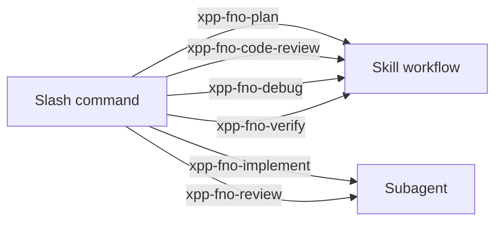

# Commands

The xpp-fno plugin ships **6 slash commands** in the `commands/` folder. They appear in Cursor's `/` menu and delegate to skills or agents.

Commands complement direct agent invocation (`/xpp-fno-planner`) — both work; commands improve discoverability in the marketplace and `/` picker.

## Full command reference

| Command | File | Delegates to | Type | When to use |
|---------|------|--------------|------|-------------|
| `/xpp-fno-plan` | `commands/xpp-fno-plan.md` | `xpp-fno-plan` skill | Skill | Structured plan in current chat |
| `/xpp-fno-implement` | `commands/xpp-fno-implement.md` | `xpp-fno-implementer` agent | Agent | Build extensions from plan or requirement |
| `/xpp-fno-review` | `commands/xpp-fno-review.md` | `xpp-fno-reviewer` agent | Agent | Pre-merge 12-step audit |
| `/xpp-fno-code-review` | `commands/xpp-fno-code-review.md` | `xpp-fno-code-review` skill | Skill | PR checklist in current chat |
| `/xpp-fno-debug` | `commands/xpp-fno-debug.md` | `xpp-fno-debug` skill / debugger | Skill | Systematic F&O debugging |
| `/xpp-fno-verify` | `commands/xpp-fno-verify.md` | `xpp-fno-verify` skill | Skill | Evidence-based verification |

## Direct agent commands (no commands/ file)

These agents are also invocable directly:

| Command | Agent | Notes |
|---------|-------|-------|
| `/xpp-fno-planner` | xpp-fno-planner | Subagent with explore — preferred for repo discovery |
| `/xpp-fno-implementer` | xpp-fno-implementer | Same as `/xpp-fno-implement` |
| `/xpp-fno-reviewer` | xpp-fno-reviewer | Same as `/xpp-fno-review` |
| `/xpp-fno-debugger` | xpp-fno-debugger | Subagent with explore/bash — preferred for complex debug |

## Command vs skill vs agent



| | Command | Skill | Agent |
|---|---------|-------|-------|
| Context | Current chat | Current chat | Isolated subagent |
| Explore/bash | Via parent | Via parent | Built-in subagents |
| Best for | Discoverability | Repeatable workflow | Multi-step isolated work |

## Usage examples

### Plan

```text
/xpp-fno-plan Add a table extension field on CustTable for customer tier with EDT and label.
```

Output: requirement summary, artifact table, quality gates, risks, next step.

Alternative with repo exploration:

```text
/xpp-fno-planner Same requirement — search repo for existing CustTable extensions first.
```

### Implement

```text
/xpp-fno-implement Implement the plan above. Publisher prefix is Contoso.
```

Or:

```text
/xpp-fno-implementer [paste plan]
```

### Review

```text
/xpp-fno-review Review my branch against the 12-step checklist.
```

Auto-chained after implementer when Ax* files were modified (see [Hooks](hooks.md)).

### Code review (in-chat)

```text
/xpp-fno-code-review Review staged X++ changes for BP and security entry points.
```

### Debug

```text
/xpp-fno-debug Batch job Contoso_ExportOrders fails with Infolog error on line 42.
```

For isolated investigation:

```text
/xpp-fno-debugger Trace why CoC on SalesTable.validateWrite is not firing.
```

### Verify

```text
/xpp-fno-verify Claim: project compiles with zero BP deviations and SalesTableMyPublisher_ValidateWriteTest passes.
```

Returns: VERIFIED / NOT VERIFIED / INCONCLUSIVE with evidence.

## Arguments

Command files support `$ARGUMENTS` — text after the command name is passed through. Example:

```text
/xpp-fno-plan Add validation on sales order credit limit
```

The implementer receives the full plan when you follow up:

```text
/xpp-fno-implement Use the plan from above.
```

## Domain skills (no dedicated command)

Domain skills (`xpp-fno-data`, `xpp-fno-extensibility`, etc.) do not have slash commands. They activate when:

- The agent selects them by description relevance
- You mention them in chat ("follow xpp-fno-data rules")
- Hooks inject hints on Ax* file writes (`preToolUse`)

## See also

- [How it works](how-it-works.md) — component architecture
- [Skills](skills.md) — skill catalog
- [Agents](agents.md) — agent workflows
- [Workflows](workflows.md) — end-to-end examples
