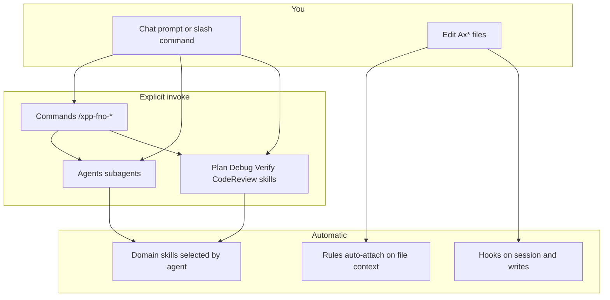

# How the xpp-fno plugin works

This guide explains how all plugin components fit together and when each one activates.

**Platform:** D365 Finance and Operations only — not AX 2012 or Business Central.

## Component overview

The plugin bundles **five** Cursor extension types:

| Component | Count (v1.1) | Role |
|-----------|--------------|------|
| **Skills** | 12 | Deep Microsoft-aligned workflows and reference (59+ atomic rules) |
| **Rules** | 10 | Short guardrails auto-attached when Ax* files are in context |
| **Agents** | 4 | Isolated subagents for multi-step plan / implement / review / debug |
| **Commands** | 6 | Slash-command entry points that delegate to skills or agents |
| **Hooks** | 4 events | Automated session setup, write hints, and workflow chaining |

## Lifecycle of a typical feature

1. **Open F&O repo** → `sessionStart` hook detects `Ax*` folders, sets `XPP_FNO_WORKSPACE=1`, injects F&O context.
2. **Plan** → `/xpp-fno-plan` (in-chat) or `/xpp-fno-planner` (subagent with explore).
3. **Implement** → `/xpp-fno-implementer` loads domain skills + rules per artifact type.
4. **While writing** → `preToolUse` injects domain hint; `postToolUse` warns on `do*` methods.
5. **After implementer** → `subagentStop` hook chains `/xpp-fno-reviewer` if Ax* files changed.
6. **Verify** (optional) → `/xpp-fno-verify` for compile/BP/SysTest evidence.
7. **Debug** (if needed) → `/xpp-fno-debug` or `/xpp-fno-debugger` for root-cause investigation.

## Skills — deep reference

Skills live in `skills/xpp-fno-*/SKILL.md`. Cursor loads **name + description** at startup; full content loads on invocation.

### Hub and domain (auto-selected)

| Skill | Purpose |
|-------|---------|
| `xpp-fno-development` | Hub — extension decision tree, quality gates, routes to domains |
| `xpp-fno-extensibility` | CoC, ExtensionOf, events, naming |
| `xpp-fno-extensible-design` | SOLID, clean code, method design |
| `xpp-fno-data` | Tables, CRUD, TTS, entities |
| `xpp-fno-business-logic` | Batch, SysOperation, performance |
| `xpp-fno-forms-ui` | Form patterns, extensions |
| `xpp-fno-security` | RBAC, entry points, XDS |
| `xpp-fno-testing` | SysTest, ATL, isolation |

Each domain skill may include `rules/*.md` (atomic BAD/GOOD examples) and `references/*.md` (pattern guides).

### Workflow skills (manual invoke only)

These have `disable-model-invocation: true` — you must invoke them explicitly:

| Skill | Command | Use when |
|-------|---------|----------|
| `xpp-fno-plan` | `/xpp-fno-plan` | Structured plan in current chat |
| `xpp-fno-code-review` | `/xpp-fno-code-review` | PR checklist in current chat |
| `xpp-fno-debug` | `/xpp-fno-debug` | Systematic debugging workflow |
| `xpp-fno-verify` | `/xpp-fno-verify` | Evidence-based verification |

See [Skills](skills.md) for the full catalog.

## Rules — file-triggered guardrails

Rules live in `rules/xpp-fno-*.mdc`. All use `alwaysApply: false` — they **auto-attach** when matching files are in the agent's context (e.g. editing `AxClass/Foo.xpp`).

| Rule | Triggers on |
|------|-------------|
| `xpp-fno-core` | All Ax* artifacts — non-negotiables |
| `xpp-fno-scenario-router` | Ax* + security/menu — technique picker |
| `xpp-fno-extensibility` | AxClass, AxForm |
| `xpp-fno-extensible-design` | AxClass |
| `xpp-fno-data-access` | AxTable, entities, queries |
| `xpp-fno-batch-logic` | Batch/SysOperation classes |
| `xpp-fno-forms-ui` | AxForm |
| `xpp-fno-security` | Security, menu items |
| `xpp-fno-testing` | Test classes |
| `xpp-fno-debugging` | AxClass — debug discipline |

Manual override: mention `@xpp-fno-core` when working outside Ax* paths.

See [Rules](rules.md) for scenario tables.

## Agents — isolated subagents

Agents run in **separate context** with access to explore/bash. Invoke with `/agent-name`.

| Agent | Readonly | Purpose |
|-------|----------|---------|
| `xpp-fno-planner` | Yes | Plan with repo exploration |
| `xpp-fno-implementer` | No | Write extensions |
| `xpp-fno-reviewer` | Yes | 12-step diff audit |
| `xpp-fno-debugger` | Yes | Root-cause debugging |

**Agents vs skills:** Agents are for multi-step isolated work. Skills are for repeatable workflows in the current chat or auto-selection by description.

See [Agents](agents.md).

## Commands — slash entry points

Commands in `commands/xpp-fno-*.md` provide discoverable `/` menu entries. Each delegates to a skill or agent:

| Command | Delegates to |
|---------|--------------|
| `/xpp-fno-plan` | `xpp-fno-plan` skill |
| `/xpp-fno-implement` | `xpp-fno-implementer` agent |
| `/xpp-fno-review` | `xpp-fno-reviewer` agent |
| `/xpp-fno-code-review` | `xpp-fno-code-review` skill |
| `/xpp-fno-debug` | `xpp-fno-debug` skill / debugger agent |
| `/xpp-fno-verify` | `xpp-fno-verify` skill |

Agent commands (`/xpp-fno-planner`, etc.) are also available directly without going through `commands/` files.

See [Commands](commands.md).

## Hooks — automation

| Event | When | Effect |
|-------|------|--------|
| `sessionStart` | New agent session | F&O context if Ax* workspace |
| `preToolUse` | Before Write/StrReplace on Ax* | Domain skill hint |
| `postToolUse` | After Write/StrReplace on Ax* | Warn on do* methods, CoC `next` placement |
| `subagentStop` | Implementer completes | Chain to reviewer |

**Local IDE only** for plugin hooks. For Cloud Agents, use project-level hooks from [d365-fno-cursor-template](https://github.com/jaderbuenodeoliveira/d365-fno-cursor-template).

See [Hooks](hooks.md).

## Choosing the right entry point

| Goal | Start here |
|------|------------|
| Quick edit, rules should guide | Just edit Ax* file (rules + hooks activate) |
| Plan multi-artifact feature | `/xpp-fno-plan` or `/xpp-fno-planner` |
| Implement from plan | `/xpp-fno-implement` or `/xpp-fno-implementer` |
| Something broke | `/xpp-fno-debug` or `/xpp-fno-debugger` |
| Prove fix works | `/xpp-fno-verify` |
| Pre-merge audit | `/xpp-fno-review` or `/xpp-fno-reviewer` |
| In-chat PR checklist | `/xpp-fno-code-review` |
| Unclear technique | Hub skill or `@xpp-fno-scenario-router` |

## Plugin vs project vs user assets

| Location | Scope |
|----------|-------|
| Plugin install | Skills, rules, agents, commands, hooks for all projects |
| `.cursor/` in F&O repo | Project overrides, Cloud Agent hooks |
| `~/.cursor/` user level | Legacy — remove xpp-fno duplicates after plugin install |

## See also

- [Getting started](getting-started.md) — install and first session
- [Workflows](workflows.md) — copy-paste examples
- [Troubleshooting](troubleshooting.md) — common issues
